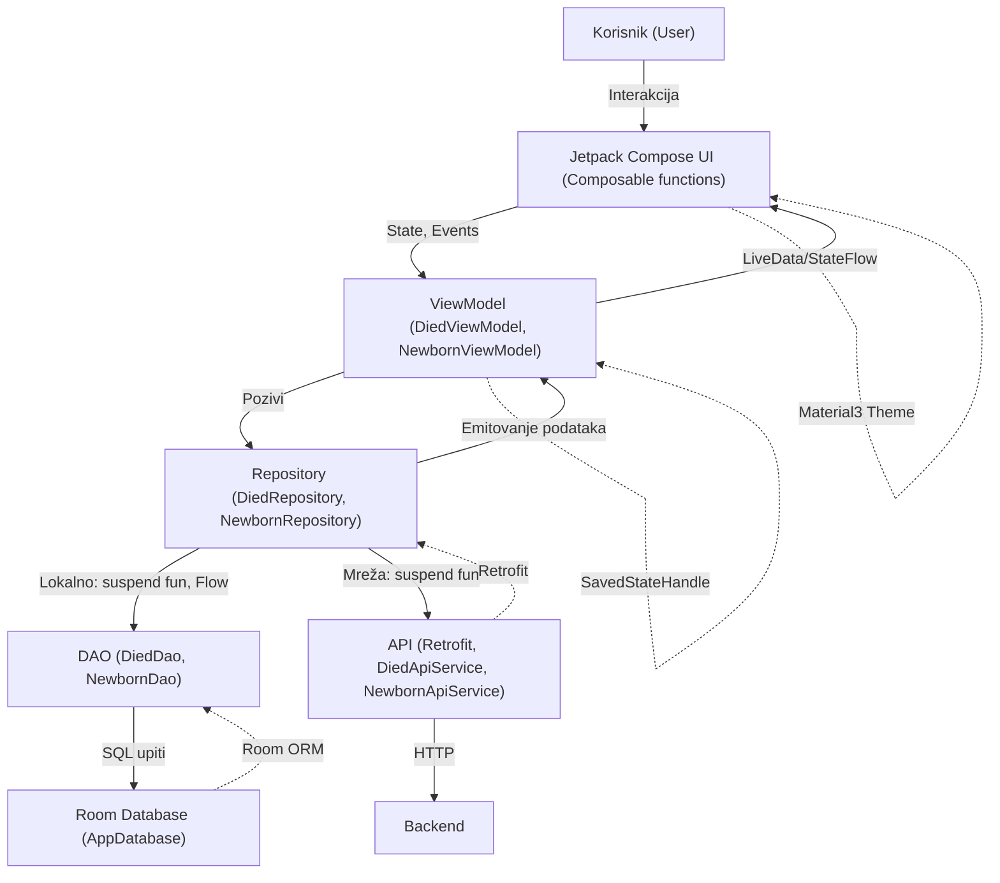

# Dokumentacija Android aplikacije: Statistika novorođenih i umrlih

---

## Sadržaj
- [Opis aplikacije i korisničkog iskustva](#opis-aplikacije-i-korisničkog-iskustva)
- [Screenshots (slike ekrana)](#screenshots-slike-ekrana)
- [Arhitektura aplikacije (MVVM)](#arhitektura-aplikacije-mvvm)
  - [Dijagram komponenti i interakcija](#dijagram-komponenti-i-interakcija)
- [Funkcionalnosti i ključne klase](#funkcionalnosti-i-kljucne-klase)
  - [ViewModel-i](#viewmodel-i)
  - [Repozitorijumi](#repozitorijumi)
  - [DAO objekti](#dao-objekti)
  - [Composable funkcije](#composable-funkcije)
- [Jetpack i Android biblioteke i koncepti](#jetpack-i-android-biblioteke-i-koncepti)
  - [Room](#room)
  - [ViewModel](#viewmodel)
  - [Jetpack Compose](#jetpack-compose)
  - [State i upravljanje stanjem](#state-i-upravljanje-stanjem)
  - [Coroutines i Flow](#coroutines-i-flow)
  - [Retrofit](#retrofit)
  - [Navigacija u Compose](#navigacija-u-compose)
  - [Material 3 Theming](#material-3-theming)
- [Opšti Android koncepti i dobre prakse](#opšti-android-koncepti-i-dobre-prakse)
- [Zaključak](#zaključak)
- [Autor i datum](#autor-i-datum)
- [12. Prilog: Primjeri koda iz projekta](#12-prilog-primjeri-koda-iz-projekta)

---

## Opis aplikacije i korisničkog iskustva

Ova Android aplikacija omogućava korisnicima pregled, pretragu, filtriranje, sortiranje i analizu podataka o novorođenim i umrlim osobama na području Bosne i Hercegovine. Podaci su dostupni po opštinama, godinama i institucijama, a korisnik može:

- Pretraživati podatke po opštini ili instituciji
- Filtrirati po godini i opštini
- Sortirati po datumu, ukupnom broju i opštini
- Dodavati podatke u favorite radi bržeg pristupa
- Prikazivati detalje svakog zapisa sa mini bar chartom
- Dijeliti podatke sa drugim aplikacijama
- Prikazivati agregirane podatke na grafikonu (bar chart po mjesecima)
- Koristiti aplikaciju na svim veličinama ekrana i u svim orijentacijama (responsive dizajn)

Aplikacija koristi moderni Material 3 dizajn, Jetpack Compose za UI, Room za lokalnu bazu, Retrofit za mrežnu komunikaciju i MVVM arhitekturu za jasno odvajanje slojeva. Svi ekrani su prilagođeni za rad na telefonima i tabletima, kao i za promjenu orijentacije.

---

## Screenshots (slike ekrana)

### 1. Početni ekran (odabir dataseta)

*Dobrodošlica i izbor između novorođenih i umrlih.*

### 2. Lista novorođenih sa filterima i pretragom

*Pretraga, filteri po opštini, godini i sortiranju, prikaz podataka i favoriti.*

### 3. Detalji podatka sa bar chartom i dijeljenjem

*Detaljan prikaz, mini bar chart, dugme za dijeljenje.*

### 4. Grafikon (bar chart po mjesecima)

*Agregirani prikaz broja novorođenih po mjesecima.*

### 5. Favoriti

*Brzi pristup omiljenim podacima.*

---

## Arhitektura aplikacije (MVVM)

Aplikacija je organizovana po MVVM (Model-View-ViewModel) arhitekturi:

- **Model**: Podaci (npr. `Died`, `Newborn`) i Room entiteti, DTO-ovi za mrežu
- **ViewModel**: Posreduje između UI i repozitorijuma, upravlja stanjem, filtrima, sortiranjem i emitovanjem podataka
- **View (UI)**: Jetpack Compose Composable funkcije, reaktivno prikazuju stanje iz ViewModel-a
- **Repository**: Centralizuje pristup podacima (baza, mreža), sadrži poslovnu logiku
- **DAO**: Interfejsi za pristup Room bazi
- **API Service**: Retrofit interfejsi za mrežnu komunikaciju

### Dijagram komponenti i interakcija



**Objašnjenje:**
- Korisnik komunicira sa UI slojem (Compose funkcije)
- UI šalje događaje i prima stanje iz ViewModel-a
- ViewModel koristi Repository za pristup podacima
- Repository koristi DAO za lokalnu bazu i API za mrežu
- Svi podaci teku reaktivno kroz Flow/StateFlow

---

## Funkcionalnosti i ključne klase

### ViewModel-i

ViewModel-i su centralna tačka za upravljanje stanjem i logikom ekrana. Svaki dataset ima svoj ViewModel:

```kotlin
class DiedViewModel(private val repository: DiedRepository) : ViewModel() {
    val uiState: StateFlow<DiedUiState>
    val filter: StateFlow<String>
    val sortBy: StateFlow<UiFilterSort.SortBy>
    // ...
}
```

- Upravljaju filterima, sortiranjem, favoritima
- Pozivaju repozitorijume za podatke
- Emituju podatke UI-u preko StateFlow

### Repozitorijumi

Repozitorijumi centralizuju pristup podacima (baza i mreža):

```kotlin
class DiedRepository(private val diedDao: DiedDao, private val api: DiedApiService) {
    suspend fun refreshDied()
    fun getAllDied(): Flow<List<Died>>
    // ...
}
```

- Sadrže suspend funkcije za dohvat, upis, brisanje
- Kombinuju podatke iz baze i mreže

### DAO objekti

DAO (Data Access Object) su interfejsi za Room bazu:

```kotlin
@Dao
interface DiedDao {
    @Query("SELECT * FROM died")
    fun getAll(): Flow<List<Died>>
    @Insert(onConflict = OnConflictStrategy.REPLACE)
    suspend fun insertAll(items: List<Died>)
    // ...
}
```

- Sadrže SQL upite kao anotirane metode
- Omogućavaju reaktivan pristup bazi

### Composable funkcije

Composable funkcije su osnovni gradivni blok UI-a:

```kotlin
@Composable
fun DiedListScreen(
    uiState: DiedUiState,
    filter: String,
    onFilterChange: (String) -> Unit,
    // ...
)
```

- Prikazuju podatke, filtere, detalje, grafikone
- Reaktivno se ažuriraju na promjenu stanja
- Korištenje Modifier-a za layout i responsivnost

---

## Jetpack i Android biblioteke i koncepti

### Room
- ORM za lokalnu bazu
- Entiteti, DAO, migracije
- Omogućava rad sa bazom kroz Kotlin klase
- Primjer entiteta:
```kotlin
@Entity(tableName = "died")
data class Died(
    @PrimaryKey val id: Int,
    val municipality: String?,
    val year: Int?,
    // ...
)
```

### ViewModel
- Upravljanje stanjem nezavisno od UI lifecycle-a
- ViewModelScope za coroutines
- SavedStateHandle za čuvanje stanja
- Primjer:
```kotlin
class NewbornViewModel(private val repository: NewbornRepository) : ViewModel() {
    // ...
}
```

### Jetpack Compose
- Deklarativni UI framework
- Composable funkcije, Modifier, Layout
- Navigation Compose za navigaciju
- Primjer:
```kotlin
@Composable
fun ChartScreen(...)
```

### State i upravljanje stanjem
- `State`, `remember`, `mutableStateOf`, `StateFlow`
- UI se automatski ažurira na promjenu stanja
- Primjer:
```kotlin
val filter by viewModel.filter.collectAsState()
```

### Coroutines i Flow
- Asinhroni rad sa podacima
- `viewModelScope.launch`, `suspend fun`, `Flow<T>`
- Reaktivno emitovanje podataka iz baze/mreže
- Primjer:
```kotlin
viewModelScope.launch {
    repository.getAllDied().collect { ... }
}
```

### Retrofit
- HTTP klijent za REST API
- Anotacije za GET/POST
- Moshi za JSON
- Primjer:
```kotlin
interface DiedApiService {
    @GET("died")
    suspend fun getDied(): List<Died>
}
```

### Navigacija u Compose
- Navigation Compose API
- NavHost, NavController, composable route
- Navigacija između ekrana i prosljeđivanje parametara
- Primjer:
```kotlin
NavHost(navController, startDestination = "list") {
    composable("list") { ... }
    composable("details/{id}") { ... }
}
```

### Material 3 Theming
- Moderni dizajn, boje, tipografija, spacing
- `MaterialTheme`, `ColorScheme`, `Typography`
- Primjer:
```kotlin
MaterialTheme(colorScheme = ..., typography = ...)
```

---

## Opšti Android koncepti i dobre prakse

- **Activity/Fragment lifecycle**: Compose UI je lifecycle-aware, ViewModel-i preživljavaju rotaciju
- **Dependency Injection**: (može se koristiti Hilt ili ručno)
- **Resursi**: Korištenje stringova, boja, tema iz res/values
- **Responsivnost**: Korištenje BoxWithConstraints, Modifier.fillMaxSize(), dinamički layout
- **Testiranje**: Moguće je koristiti JUnit, Espresso, Compose test
- **Dijeljenje podataka**: Korištenje Intenta za dijeljenje podataka iz detalja
- **Favoriti**: Implementirani kao posebna tabela u Room bazi
- **Bar chart**: Prikaz podataka pomoću Canvas-a u Compose-u

---

## Zaključak

Aplikacija je modularna, skalabilna i spremna za proširenje. Korištenjem MVVM arhitekture, Jetpack Compose-a i modernih Android biblioteka, omogućava se lako održavanje, testiranje i proširenje funkcionalnosti. Responsive dizajn i Material 3 osiguravaju odličan korisnički doživljaj na svim uređajima. Svi ekrani su prilagođeni za rad na telefonima i tabletima, kao i za promjenu orijentacije.

---

## Autor i datum

- Autor: [OVDJE UPISATI IME I PREZIME]
- Datum: [OVDJE UPISATI DATUM PREDJE]

---

## 12. Prilog: Primjeri koda iz projekta

Ova sekcija sadrži konkretne primjere koda iz ovog projekta, sa kratkim objašnjenjem konteksta i funkcionalnosti. Primjeri su izvučeni iz stvarne implementacije i pokrivaju ključne dijelove aplikacije: prikaz podataka, favorite, dijeljenje, ViewModel, Room, Retrofit, Compose komponente, filtriranje, sortiranje i grafikon.

### Prikaz liste podataka (novorođeni/umrli)

Prikaz podataka koristi `LazyColumn` sa filterima i sortiranjima:

```kotlin
LazyColumn(modifier = Modifier.weight(1f).fillMaxHeight()) {
    items(uiState.data.size) { idx ->
        val item = uiState.data[idx]
        val isFavorite = favorites.any { fav -> fav.id == item.id }
        ListItem(
            headlineContent = { Text(item.municipality ?: "Nepoznato") },
            supportingContent = { Text("${item.institution ?: "Nepoznato"}, ${item.dateUpdate ?: "Nepoznato"}") },
            trailingContent = {
                IconButton(onClick = { onFavoriteClick(item) }) {
                    Icon(
                        imageVector = if (isFavorite) Icons.Default.Favorite else Icons.Default.FavoriteBorder,
                        contentDescription = null
                    )
                }
            },
            modifier = Modifier.clickable { onItemClick(item.id) }
        )
        Divider()
    }
}
```

### Dodavanje/uklanjanje iz favorita

Favoriti se čuvaju u posebnoj tabeli u Room bazi, a logika je u ViewModel-u:

```kotlin
fun toggleFavorite(died: Died) {
    viewModelScope.launch {
        if (repository.isFavorite(died.id)) {
            repository.removeFavorite(died)
        } else {
            repository.addFavorite(died)
        }
    }
}
```

### Dijeljenje podatka iz detalja

Korisnik može podijeliti podatak iz detalja preko Intenta:

```kotlin
val shareText = "Opština: ${it.municipality ?: "Nepoznato"}\n" +
    "Institucija: ${it.institution ?: "Nepoznato"}\n" +
    "Datum: ${it.dateUpdate ?: "Nepoznato"}\n" +
    "Muških: ${it.maleTotal ?: 0}\n" +
    "Ženskih: ${it.femaleTotal ?: 0}\n" +
    "Ukupno: ${it.total ?: 0}"
val sendIntent = Intent().apply {
    action = Intent.ACTION_SEND
    putExtra(Intent.EXTRA_TEXT, shareText)
    type = "text/plain"
}
context.startActivity(Intent.createChooser(sendIntent, "Podijeli podatke"))
```

### ViewModel sa StateFlow i filtriranjem

ViewModel koristi StateFlow za reaktivno upravljanje stanjem i filterima:

```kotlin
class DiedViewModel(private val repository: DiedRepository) : ViewModel() {
    private val _uiState = MutableStateFlow<DiedUiState>(DiedUiState.Loading)
    val uiState: StateFlow<DiedUiState> = _uiState
    private val _filter = MutableStateFlow("")
    val filter: StateFlow<String> = _filter
    // ...
    fun setFilter(query: String) {
        _filter.value = query
        refreshAndObserve()
    }
}
```

### Room DAO upit

DAO interfejs za pristup Room bazi:

```kotlin
@Dao
interface DiedDao {
    @Query("SELECT * FROM died")
    fun getAll(): Flow<List<Died>>
    @Insert(onConflict = OnConflictStrategy.REPLACE)
    suspend fun insertAll(items: List<Died>)
    // ...
}
```

### Retrofit API servis

Retrofit interfejs za mrežnu komunikaciju:

```kotlin
interface DiedApiService {
    @GET("died")
    suspend fun getDied(): List<Died>
}
```

### Custom Compose komponenta: Filter dugmad

Filteri su implementirani kao OutlinedButton dropdownovi:

```kotlin
Row(
    modifier = Modifier.fillMaxWidth(),
    horizontalArrangement = Arrangement.spacedBy(8.dp)
) {
    Box {
        OutlinedButton(onClick = { municipalityExpanded = true }) {
            Text(selectedMunicipality ?: "Opština")
        }
        DropdownMenu(expanded = municipalityExpanded, onDismissRequest = { municipalityExpanded = false }) {
            DropdownMenuItem(text = { Text("Sve opštine") }, onClick = { onMunicipalityChange(null); municipalityExpanded = false })
            municipalities.forEach { m ->
                DropdownMenuItem(text = { Text(m) }, onClick = { onMunicipalityChange(m); municipalityExpanded = false })
            }
        }
    }
    // ... (Godina, Sortiranje)
}
```

### Prikaz grafikona (bar chart)

Bar chart je crtan pomoću Canvas-a u Compose-u:

```kotlin
Canvas(modifier = Modifier.fillMaxWidth().height(220.dp)) {
    val barWidth = size.width / 14f
    val space = barWidth * 0.5f
    for (i in 0 until 12) {
        val value = grouped[i + 1] ?: 0
        val barHeight = (value / max.toFloat()) * (size.height * 0.7f)
        val x = i * (barWidth + space) + space
        drawRect(
            color = barColor,
            topLeft = Offset(x, size.height - barHeight),
            size = Size(barWidth, barHeight)
        )
    }
}
```

### Responsive layout sa BoxWithConstraints

Za prilagodbu svim veličinama ekrana koristi se BoxWithConstraints:

```kotlin
BoxWithConstraints(modifier = Modifier.fillMaxSize().padding(contentPadding).padding(8.dp)) {
    val isWide = maxWidth > 600.dp
    if (isWide) {
        // Prikaz u dva reda (tablet, landscape)
    } else {
        // Prikaz u jednom stupcu (telefon, portrait)
    }
}
```

---

## Opis svakog ekrana sa screenshotom

### Onboarding ekran

*Na ovom ekranu korisnik bira dataset koji želi pregledati: novorođeni ili umrli. Ekran je jednostavan, sa jasnim dugmadima i dobrodošlicom.*

### Lista podataka

*Prikazuje sve podatke za izabrani dataset. Na vrhu je search bar, ispod su filteri (opština, godina, sortiranje). Svaki podatak prikazuje opštinu, instituciju, datum i ima ikonu za dodavanje u favorite. Navigacija na detalje je omogućena klikom na podatak.*

### Detalji podatka

*Detaljan prikaz podatka sa svim informacijama, mini bar chartom i dugmetom za dijeljenje. Responsive layout osigurava da je sve pregledno i na tabletu i na telefonu.*

### Grafikon

*Prikazuje agregirane podatke po mjesecima u obliku bar charta. Brojevi su iznad stubića, mjeseci ispod, sve je responsive i prilagođeno veličini ekrana.*

### Favoriti

*Lista omiljenih podataka, omogućava brzi pristup i navigaciju na detalje.*

---

Ova sekcija omogućava brzu orijentaciju u kodu i arhitekturi projekta, kao i lakše razumijevanje implementacije za svakog čitaoca ili recenzenta. 