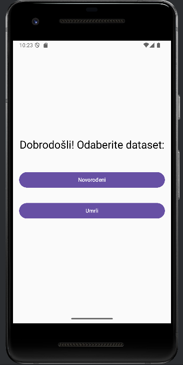
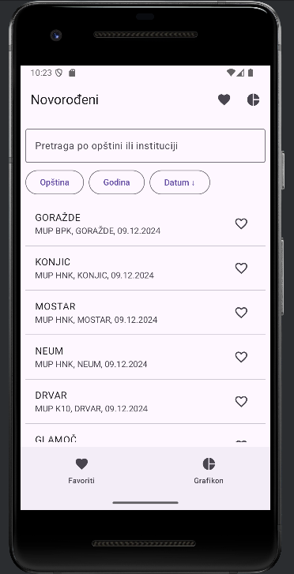
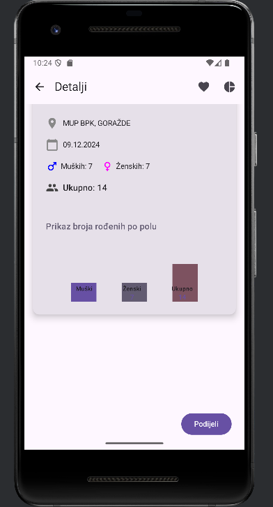
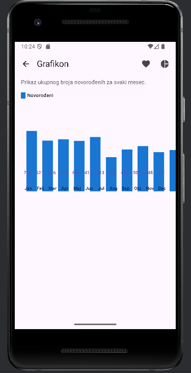
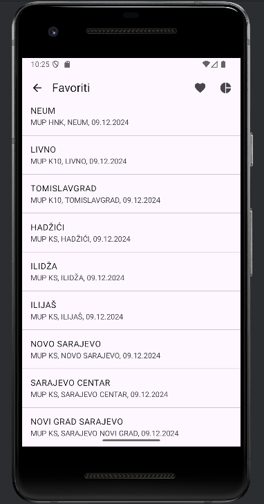
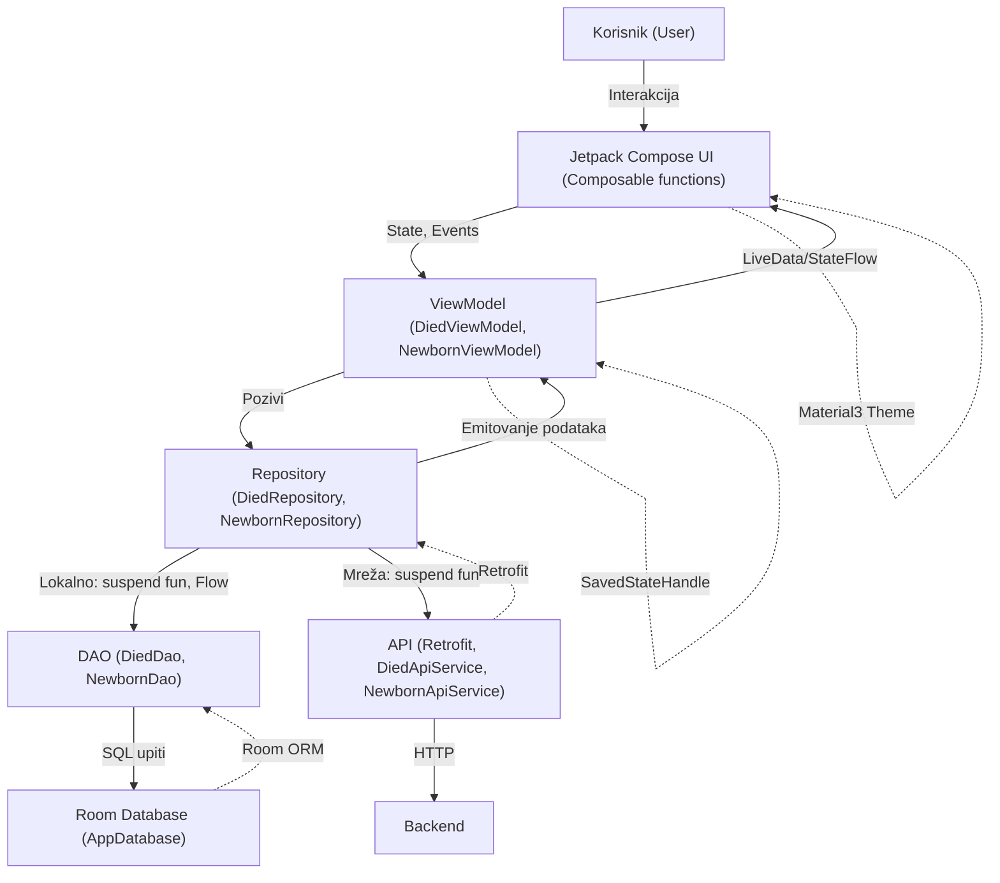

# Dokumentacija Android aplikacije: Statistika novorođenih i umrlih

---

## Uvod

Ova Android aplikacija je razvijena s ciljem da omogući jednostavan, brz i moderan pregled statističkih podataka o novorođenim i umrlim osobama na području Bosne i Hercegovine. Aplikacija je namijenjena širokom spektru korisnika – od građana, preko zdravstvenih i administrativnih radnika, do istraživača i studenata. Kroz intuitivan interfejs, korisnik može lako pretraživati, filtrirati, sortirati i analizirati podatke, kao i vizualizovati ih putem grafikona. Poseban naglasak je stavljen na responzivnost i prilagodljivost svim veličinama ekrana, kao i na upotrebu savremenih Android tehnologija (Jetpack Compose, Room, Retrofit, MVVM).

---

## Funkcionalnosti aplikacije

Aplikacija omogućava sljedeće funkcionalnosti:

- **Odabir dataset-a**: Na početnom ekranu korisnik bira da li želi pregledati podatke o novorođenima ili umrlima. Ova funkcionalnost omogućava personalizovan i fokusiran rad, jer korisnik odmah bira relevantan skup podataka. Nakon izbora, aplikacija pamti izbor i vodi korisnika na odgovarajuću listu.
- **Prikaz liste podataka**: Prikaz svih zapisa za izabrani dataset, sa osnovnim informacijama (opština, institucija, datum). Lista je optimizovana za brz prikaz i podržava beskonačno skrolanje. Svaka stavka je jasno odvojena, a korisnik može lako prepoznati relevantne informacije.
- **Pretraga**: Brza pretraga po opštini ili instituciji putem search bara. Korisnik može unijeti dio naziva opštine ili institucije i odmah filtrirati prikazanu listu, što značajno ubrzava pronalaženje podataka.
- **Filtriranje**: Mogućnost filtriranja podataka po opštini i godini, kroz pregledne dropdown filtere. Filteri su uvijek vidljivi i lako dostupni, a promjena filtera automatski ažurira prikaz.
- **Sortiranje**: Sortiranje podataka po datumu, ukupnom broju i opštini (uzlazno i silazno). Korisnik može jednim klikom promijeniti način sortiranja, što omogućava brzo poređenje i analizu podataka.
- **Favoriti**: Dodavanje i uklanjanje zapisa iz omiljenih, sa posebnim ekranom za pregled favorita. Favoriti su jasno označeni, a korisnik može brzo pristupiti najvažnijim podacima bez potrebe za ponovnim pretraživanjem ili filtriranjem.
- **Detaljan prikaz**: Prikaz svih detalja o pojedinačnom zapisu, uključujući mini bar chart (vizualizacija broja po polu). Detalji su prikazani pregledno, sa jasnim ikonama i bojama, a bar chart omogućava brzu vizualnu analizu.
- **Dijeljenje podataka**: Mogućnost dijeljenja detalja zapisa putem drugih aplikacija (npr. Viber, e-mail, poruke). Dijeljenje je omogućeno jednim klikom, a formatirani tekst sadrži sve ključne informacije.
- **Grafikon**: Prikaz agregiranih podataka po mjesecima u obliku bar charta, sa jasno prikazanim vrijednostima i mjesecima. Grafikon je interaktivan i prilagođava se veličini ekrana, omogućavajući korisniku da lako uoči trendove i sezonske promjene.
- **Responsivnost**: Svi ekrani su prilagođeni za rad na telefonima i tabletima, kao i za promjenu orijentacije (portrait/landscape). Layout se automatski prilagođava, a svi elementi ostaju pregledni i funkcionalni.
- **Moderni dizajn**: Korištenje Material 3 dizajna, jasnih boja, tipografije i animacija. UI je prilagođen i osobama sa slabijim vidom (kontrast, veličina fonta).
- **Lokalna baza i rad bez interneta**: Podaci se keširaju u Room bazi, omogućavajući rad i bez aktivne internet konekcije. Prilikom gubitka interneta, korisnik i dalje može pregledati prethodno učitane podatke.
- **Sigurnost i performanse**: Korištenje najboljih praksi za upravljanje podacima, asinhroni rad sa Flow/Coroutines, odvajanje slojeva (MVVM). Svi podaci se obrađuju na siguran način, a aplikacija je otporna na greške i padove.

---

## Struktura projekta

Projekat je organizovan na jasan i modularan način, što olakšava održavanje, testiranje i proširenje aplikacije. Glavne komponente i folderi su:

```
ProjekatRazvoj/
├── app/
│   ├── build.gradle.kts
│   └── src/
│       ├── main/
│       │   ├── AndroidManifest.xml
│       │   ├── java/com/example/projekatrazvoj/
│       │   │   ├── db/           # Room baze i DAO interfejsi
│       │   │   ├── model/        # Podaci, entiteti, DTO-ovi
│       │   │   ├── network/      # Retrofit API servisi
│       │   │   ├── repository/   # Repozitorijumi (logika pristupa podacima)
│       │   │   ├── ui/           # Jetpack Compose ekrani i komponente
│       │   │   │   ├── components/   # TopBar, BottomBar, zajedničke komponente
│       │   │   │   └── theme/        # Boje, tipografija, teme
│       │   │   ├── viewmodel/    # ViewModel-i za svaki dataset
│       │   │   └── MainActivity.kt   # Ulazna tačka aplikacije
│       │   └── res/              # Resursi (slike, stringovi, boje, teme)
│       └── test/                 # Testovi
├── gradle/                       # Gradle wrapper i konfiguracija
├── screenshots/                  # Screenshots za dokumentaciju
├── DOCUMENTATION.md              # Ova dokumentacija
├── README.md                     # Kratki opis projekta
└── ...
```

**Objašnjenje ključnih foldera i fajlova:**
- `db/` – Sadrži Room baze i DAO interfejse za pristup lokalnim podacima.
- `model/` – Definicije podataka, entiteta i DTO-ova za mrežu i bazu.
- `network/` – Retrofit servisi za komunikaciju sa API-jem.
- `repository/` – Repozitorijumi koji centralizuju pristup podacima (baza i mreža).
- `ui/` – Svi Compose ekrani, komponente i teme. Podijeljeno na ekrane, zajedničke komponente i teme.
- `viewmodel/` – ViewModel-i za upravljanje stanjem svakog ekrana/dataset-a.
- `screenshots/` – Slike ekrana za dokumentaciju.
- `DOCUMENTATION.md` – Detaljna tehnička i korisnička dokumentacija.
- `README.md` – Kratki opis i uputstvo za pokretanje projekta.

Ovakva struktura omogućava lako snalaženje, jasnu separaciju odgovornosti i brzo proširenje aplikacije novim funkcionalnostima ili dataset-ima.

---

## Sadržaj
- [Opis aplikacije i korisničkog iskustva](#opis-aplikacije-i-korisničkog-iskustva)
- [Screenshots (slike ekrana)](#screenshots-slike-ekrana)
- [Arhitektura aplikacije (MVVM)](#arhitektura-aplikacije-mvvm)
  - [Dijagram komponenti i interakcija](#dijagram-komponenti-i-interakcija)
- [Funkcionalnosti i ključne klase](#funkcionalnosti-i-kljucne-klase)
  - [ViewModel-i](#viewmodel-i)
  - [Repozitorijumi](#repozitorijumi)
  - [DAO objekti](#dao-objekti)
  - [Composable funkcije](#composable-funkcije)
- [Jetpack i Android biblioteke i koncepti](#jetpack-i-android-biblioteke-i-koncepti)
  - [Room](#room)
  - [ViewModel](#viewmodel)
  - [Jetpack Compose](#jetpack-compose)
  - [State i upravljanje stanjem](#state-i-upravljanje-stanjem)
  - [Coroutines i Flow](#coroutines-i-flow)
  - [Retrofit](#retrofit)
  - [Navigacija u Compose](#navigacija-u-compose)
  - [Material 3 Theming](#material-3-theming)
- [Opšti Android koncepti i dobre prakse](#opšti-android-koncepti-i-dobre-prakse)
- [Zaključak](#zaključak)
- [Autor i datum](#autor-i-datum)
- [Verzijsko upravljanje i zavisnosti](#verzijsko-upravljanje-i-zavisnosti)
- [API-ji i datasetovi](#api-ji-i-datasetovi)
- [Upravljanje stanjem i performansama](#upravljanje-stanjem-i-performansama)
- [12. Prilog: Primjeri koda iz projekta](#12-prilog-primjeri-koda-iz-projekta)

---

## Opis aplikacije i korisničkog iskustva

Ova Android aplikacija omogućava korisnicima pregled, pretragu, filtriranje, sortiranje i analizu podataka o novorođenim i umrlim osobama na području Bosne i Hercegovine. Podaci su dostupni po opštinama, godinama i institucijama, a korisnik može:

- Pretraživati podatke po opštini ili instituciji
- Filtrirati po godini i opštini
- Sortirati po datumu, ukupnom broju i opštini
- Dodavati podatke u favorite radi bržeg pristupa
- Prikazivati detalje svakog zapisa sa mini bar chartom
- Dijeliti podatke sa drugim aplikacijama
- Prikazivati agregirane podatke na grafikonu (bar chart po mjesecima)
- Koristiti aplikaciju na svim veličinama ekrana i u svim orijentacijama (responsive dizajn)

Aplikacija koristi moderni Material 3 dizajn, Jetpack Compose za UI, Room za lokalnu bazu, Retrofit za mrežnu komunikaciju i MVVM arhitekturu za jasno odvajanje slojeva. Svi ekrani su prilagođeni za rad na telefonima i tabletima, kao i za promjenu orijentacije.

---

## Opis svakog ekrana sa screenshotom

### Onboarding ekran


Ovaj ekran je prva tačka kontakta korisnika sa aplikacijom. Prikazuje jasnu dobrodošlicu i omogućava izbor između dva glavna dataset-a: novorođeni i umrli. Dizajn je minimalistički, sa velikim, preglednim dugmadima i centralno poravnatim tekstom, što olakšava korištenje na svim veličinama ekrana. Dugmad su dovoljno velika za udoban rad na svim uređajima, a kontrastne boje i jednostavan raspored omogućavaju lako snalaženje i korisnicima sa slabijim vidom ili motoričkim sposobnostima. Nakon odabira, korisnik se automatski preusmjerava na odgovarajuću listu podataka, čime se osigurava brz i intuitivan početak rada sa aplikacijom.

---

### Lista podataka


Na ovom ekranu korisnik vidi listu svih zapisa za izabrani dataset. Na vrhu se nalazi search bar za brzu pretragu po opštini ili instituciji, što omogućava korisniku da odmah pronađe relevantne podatke. Ispod su filteri (opština, godina, sortiranje) implementirani kao pregledni i lako dostupni dropdown dugmići. Lista je jasno strukturirana: svaki podatak prikazuje opštinu, instituciju i datum, a desno je ikona za dodavanje ili uklanjanje iz favorita. Navigacija na detalje je omogućena klikom na bilo koji podatak. UI je prilagođen za rad na svim veličinama ekrana, a boje i tipografija su u skladu sa Material 3 dizajnom. Lista podržava beskonačno skrolanje i uvijek je glatka, čak i sa velikim brojem podataka.

---

### Detalji podatka


Ovaj ekran prikazuje sve detalje o izabranom zapisu. Prikazane su informacije o opštini, instituciji, datumu, broju muških i ženskih, ukupno, kao i mini bar chart koji vizualizuje podatke po polu. Na dnu ekrana nalazi se dugme za dijeljenje podatka, koje otvara standardni Android dijalog za dijeljenje. Layout je responsive: na tabletima i u landscape modu, podaci i grafikon su prikazani u dva stupca, dok je na telefonima sve u jednom stupcu. Sve informacije su jasno istaknute, a korisnik može lako podijeliti podatak ili ga dodati u favorite. Bar chart omogućava brzu vizualnu analizu odnosa između muških, ženskih i ukupnog broja.

---

### Grafikon


Na ovom ekranu korisnik vidi agregirane podatke po mjesecima, prikazane kao bar chart. Svaki stubić predstavlja jedan mjesec, iznad su brojevi, ispod su oznake mjeseci. Legenda i opis grafikona su jasno istaknuti, što korisniku omogućava da odmah razumije šta grafikon prikazuje. Prikaz je potpuno responsive: na širokim ekranima grafikon i legenda su u dva stupca, na uskim ekranima sve je u jednom stupcu. Ovaj ekran omogućava korisniku da brzo vizualno uporedi podatke kroz godinu, identifikuje trendove i sezonske promjene.

---

### Favoriti


Ovaj ekran prikazuje sve zapise koje je korisnik označio kao omiljene. Lista je identična kao glavna lista, ali prikazuje samo favorite. Omogućava brzi pristup i navigaciju na detalje svakog omiljenog podatka. Dodavanje i uklanjanje iz favorita je moguće direktno sa ovog ekrana, a svi favoriti su jasno označeni. UI je pregledan i omogućava korisniku da lako upravlja svojim omiljenim podacima, bez potrebe za dodatnim pretragama ili filtrima.

---

## Tehnički detalji i implementacija

### Onboarding ekran
- Implementiran kao Composable funkcija (`OnboardingScreen`).
- Dugmad koriste `Button` ili `OutlinedButton` iz Material 3.
- Navigacija se vrši pomoću Navigation Compose (`navController.navigate("list")` ili `navController.navigate("died_list")`).
- UI je responsive zahvaljujući Modifier-ima i centriranju.
- Nema potrebe za ViewModel-om jer je logika jednostavna i stateless.

### Lista podataka
- Prikaz koristi `LazyColumn` za efikasno renderovanje velikog broja stavki.
- Filteri su OutlinedButton + DropdownMenu, povezani sa ViewModel-om.
- Search bar je `OutlinedTextField` sa dvosmjernim bindingom na filter state.
- Svaka stavka koristi `ListItem` iz Material 3.
- Ikona za favorite koristi `IconButton` i reaguje na klik (poziva `toggleFavorite` iz ViewModel-a).
- State management: svi filteri, search i sort su u ViewModel-u (`StateFlow`).
- Navigacija na detalje: klik na stavku poziva `onItemClick(item.id)`.
- Responsive layout: koristi Modifier.fillMaxWidth(), BoxWithConstraints za prilagodbu.
- Podaci dolaze iz Room baze i/ili sa API-ja, kroz Repository sloj.
- ViewModel automatski filtrira, sortira i emitira podatke na osnovu promjena stanja.

### Detalji podatka
- Ekran je Composable funkcija (`DetailsScreen` ili `DiedDetailsScreen`).
- Podaci se dobijaju iz ViewModel-a (`selectedNewborn` ili `selectedDied`).
- Bar chart je crtan pomoću `Canvas` u Compose-u.
- Dijeljenje koristi Android `Intent.ACTION_SEND` (vidi primjer koda u prilogu).
- Responsive layout: koristi `BoxWithConstraints` i prilagođava raspored prema širini ekrana.
- Svi podaci su reaktivno vezani na ViewModel (StateFlow).
- Dugme za favorite i dijeljenje su uvijek vidljivi i pristupačni.
- Navigacija na ovaj ekran se vrši iz liste, sa prosljeđivanjem ID-a podatka.

### Grafikon
- Composable funkcija `ChartScreen`.
- Bar chart je crtan pomoću `Canvas` i koristi dinamičke veličine.
- Podaci se grupišu po mjesecima u ViewModel-u i prosljeđuju u Composable.
- Responsive layout: koristi `BoxWithConstraints` i prilagođava raspored.
- Legenda koristi `Canvas` i `Text` za prikaz boje i oznake.
- Svi brojevi i oznake su centrirani i skaliraju se prema veličini ekrana.
- State management: podaci dolaze iz ViewModel-a kao lista agregiranih vrijednosti.
- Navigacija na ovaj ekran je omogućena iz donjeg bara (BottomBar).

### Favoriti
- Prikaz koristi `LazyColumn` i `ListItem` kao i glavna lista.
- Podaci dolaze iz ViewModel-a (`favorites: StateFlow<List<DiedFavorite>>` ili `List<NewbornFavorite>`).
- Klik na stavku vodi na detalje (koristi istu logiku kao i glavna lista).
- Uklanjanje iz favorita poziva `toggleFavorite` iz ViewModel-a.
- Responsive layout: koristi iste Modifier-e i BoxWithConstraints kao i ostali ekrani.
- State management: favoriti su posebna tabela u Room bazi, sinhronizovani sa glavnim podacima.
- Navigacija na ovaj ekran je omogućena iz donjeg bara (BottomBar) ili iz glavne liste.

---

## Arhitektura aplikacije (MVVM)

Aplikacija je organizovana po MVVM (Model-View-ViewModel) arhitekturi:

- **Model**: Podaci (npr. `Died`, `Newborn`) i Room entiteti, DTO-ovi za mrežu
- **ViewModel**: Posreduje između UI i repozitorijuma, upravlja stanjem, filtrima, sortiranjem i emitovanjem podataka
- **View (UI)**: Jetpack Compose Composable funkcije, reaktivno prikazuju stanje iz ViewModel-a
- **Repository**: Centralizuje pristup podacima (baza, mreža), sadrži poslovnu logiku
- **DAO**: Interfejsi za pristup Room bazi
- **API Service**: Retrofit interfejsi za mrežnu komunikaciju

### Dijagram komponenti i interakcija



**Objašnjenje:**
- Korisnik komunicira sa UI slojem (Compose funkcije)
- UI šalje događaje i prima stanje iz ViewModel-a
- ViewModel koristi Repository za pristup podacima
- Repository koristi DAO za lokalnu bazu i API za mrežu
- Svi podaci teku reaktivno kroz Flow/StateFlow

---

## Funkcionalnosti i ključne klase

### ViewModel-i

ViewModel-i su centralna tačka za upravljanje stanjem i logikom ekrana. Svaki dataset ima svoj ViewModel:

```kotlin
class DiedViewModel(private val repository: DiedRepository) : ViewModel() {
    val uiState: StateFlow<DiedUiState>
    val filter: StateFlow<String>
    val sortBy: StateFlow<UiFilterSort.SortBy>
    // ...
}
```

- Upravljaju filterima, sortiranjem, favoritima
- Pozivaju repozitorijume za podatke
- Emituju podatke UI-u preko StateFlow

### Repozitorijumi

Repozitorijumi centralizuju pristup podacima (baza i mreža):

```kotlin
class DiedRepository(private val diedDao: DiedDao, private val api: DiedApiService) {
    suspend fun refreshDied()
    fun getAllDied(): Flow<List<Died>>
    // ...
}
```

- Sadrže suspend funkcije za dohvat, upis, brisanje
- Kombinuju podatke iz baze i mreže

### DAO objekti

DAO (Data Access Object) su interfejsi za Room bazu:

```kotlin
@Dao
interface DiedDao {
    @Query("SELECT * FROM died")
    fun getAll(): Flow<List<Died>>
    @Insert(onConflict = OnConflictStrategy.REPLACE)
    suspend fun insertAll(items: List<Died>)
    // ...
}
```

- Sadrže SQL upite kao anotirane metode
- Omogućavaju reaktivan pristup bazi

### Composable funkcije

Composable funkcije su osnovni gradivni blok UI-a:

```kotlin
@Composable
fun DiedListScreen(
    uiState: DiedUiState,
    filter: String,
    onFilterChange: (String) -> Unit,
    // ...
)
```

- Prikazuju podatke, filtere, detalje, grafikone
- Reaktivno se ažuriraju na promjenu stanja
- Korištenje Modifier-a za layout i responsivnost

---

## Jetpack i Android biblioteke i koncepti

### Room
- ORM za lokalnu bazu
- Entiteti, DAO, migracije
- Omogućava rad sa bazom kroz Kotlin klase
- Primjer entiteta:
```kotlin
@Entity(tableName = "died")
data class Died(
    @PrimaryKey val id: Int,
    val municipality: String?,
    val year: Int?,
    // ...
)
```

### ViewModel
- Upravljanje stanjem nezavisno od UI lifecycle-a
- ViewModelScope za coroutines
- SavedStateHandle za čuvanje stanja
- Primjer:
```kotlin
class NewbornViewModel(private val repository: NewbornRepository) : ViewModel() {
    // ...
}
```

### Jetpack Compose
- Deklarativni UI framework
- Composable funkcije, Modifier, Layout
- Navigation Compose za navigaciju
- Primjer:
```kotlin
@Composable
fun ChartScreen(...)
```

### State i upravljanje stanjem
- `State`, `remember`, `mutableStateOf`, `StateFlow`
- UI se automatski ažurira na promjenu stanja
- Primjer:
```kotlin
val filter by viewModel.filter.collectAsState()
```

### Coroutines i Flow
- Asinhroni rad sa podacima
- `viewModelScope.launch`, `suspend fun`, `Flow<T>`
- Reaktivno emitovanje podataka iz baze/mreže
- Primjer:
```kotlin
viewModelScope.launch {
    repository.getAllDied().collect { ... }
}
```

### Retrofit
- HTTP klijent za REST API
- Anotacije za GET/POST
- Moshi za JSON
- Primjer:
```kotlin
interface DiedApiService {
    @GET("died")
    suspend fun getDied(): List<Died>
}
```

### Navigacija u Compose
- Navigation Compose API
- NavHost, NavController, composable route
- Navigacija između ekrana i prosljeđivanje parametara
- Primjer:
```kotlin
NavHost(navController, startDestination = "list") {
    composable("list") { ... }
    composable("details/{id}") { ... }
}
```

### Material 3 Theming
- Moderni dizajn, boje, tipografija, spacing
- `MaterialTheme`, `ColorScheme`, `Typography`
- Primjer:
```kotlin
MaterialTheme(colorScheme = ..., typography = ...)
```

---

## Opšti Android koncepti i dobre prakse

- **Activity/Fragment lifecycle**: Compose UI je lifecycle-aware, ViewModel-i preživljavaju rotaciju
- **Dependency Injection**: (može se koristiti Hilt ili ručno)
- **Resursi**: Korištenje stringova, boja, tema iz res/values
- **Responsivnost**: Korištenje BoxWithConstraints, Modifier.fillMaxSize(), dinamički layout
- **Testiranje**: Moguće je koristiti JUnit, Espresso, Compose test
- **Dijeljenje podataka**: Korištenje Intenta za dijeljenje podataka iz detalja
- **Favoriti**: Implementirani kao posebna tabela u Room bazi
- **Bar chart**: Prikaz podataka pomoću Canvas-a u Compose-u

---

## Zaključak

Aplikacija je modularna, skalabilna i spremna za proširenje. Korištenjem MVVM arhitekture, Jetpack Compose-a i modernih Android biblioteka, omogućava se lako održavanje, testiranje i proširenje funkcionalnosti. Responsive dizajn i Material 3 osiguravaju odličan korisnički doživljaj na svim uređajima. Svi ekrani su prilagođeni za rad na telefonima i tabletima, kao i za promjenu orijentacije.

---

## Korištene tehnologije

- **Kotlin** – Glavni programski jezik za razvoj Android aplikacija, moderan, siguran i podržava sve napredne funkcionalnosti.
- **Jetpack Compose** – Deklarativni UI framework za izradu modernih, responzivnih i prilagodljivih korisničkih interfejsa.
- **Room** – ORM biblioteka za rad sa lokalnom SQLite bazom, omogućava jednostavno čuvanje i dohvat podataka.
- **Retrofit** – HTTP klijent za komunikaciju sa REST API-jem, koristi Moshi za parsiranje JSON-a.
- **Coroutines & Flow** – Za asinhroni rad, reaktivno emitovanje i obradu podataka, omogućava glatko korisničko iskustvo bez blokiranja UI-a.
- **Material 3** – Najnoviji dizajn sistem za Android, sa podrškom za tamni/svijetli mod, tipografiju i boje.
- **Navigation Compose** – Za deklarativnu i sigurnu navigaciju između ekrana.
- **StateFlow & MutableStateFlow** – Za reaktivno upravljanje stanjem u ViewModel-ima.
- **Gradle (KTS)** – Za upravljanje zavisnostima i build procesom.
- **Android Lifecycle** – Za pravilno upravljanje životnim ciklusom komponenti.

---

## Error handling i prikaz grešaka

- **Try/Catch blokovi**: Svi mrežni i bazni pozivi su obavijeni try/catch blokovima kako bi se spriječio pad aplikacije.
- **ViewModel error state**: Svaki ViewModel ima stanje za grešku (npr. `DiedUiState.Error`), koje UI može prikazati korisniku.
- **Prikaz grešaka u UI-u**: Greške se prikazuju kao poruke na ekranu (npr. crveni tekst ili snackbar), sa jasnim objašnjenjem (npr. "Greška: Nema interneta").
- **Fallback na lokalnu bazu**: Ako mrežni poziv ne uspije, aplikacija automatski koristi podatke iz Room baze.
- **Offline rad**: Korisnik može pregledati podatke i bez interneta, a aplikacija jasno prikazuje kada koristi keširane podatke.
- **Logovanje grešaka**: Sve greške se mogu logovati za potrebe debugovanja (npr. Logcat).

---

## Verzijsko upravljanje i zavisnosti

- **Git**: Za verzijsko upravljanje projektom, omogućava praćenje svih promjena, rad u timovima i vraćanje na prethodne verzije.
- **Branching**: Razvoj se može odvijati na posebnom branchu (npr. `feature/novi-ekran`), a stabilne verzije se čuvaju na `main` ili `master` branchu.
- **Remote repozitorijum**: Projekat se hostuje na GitHub-u ([https://github.com/ismailmehic/ProjekatRazvoj](https://github.com/ismailmehic/ProjekatRazvoj)).
- **Gradle (build.gradle.kts)**: Svi dependency-i su definisani u Kotlin DSL fajlovima, sa jasno navedenim verzijama.
- **libs.versions.toml**: Centralizovano upravljanje verzijama biblioteka radi lakšeg održavanja i nadogradnje.
- **Automatsko preuzimanje zavisnosti**: Prilikom builda, Gradle automatski preuzima sve potrebne biblioteke.

---

## Autor i datum

- Autor: ISMAIL MEHIĆ
- Datum: 01.07.2025

---

## API-ji i datasetovi

- **REST API**: Aplikacija koristi REST API za dohvat podataka o novorođenima i umrlima. API-jevi su dizajnirani tako da omogućavaju filtriranje, pretragu i paginaciju podataka, čime se smanjuje količina prenesenih podataka i ubrzava rad aplikacije.
- **Retrofit**: Za komunikaciju sa API-jem koristi se Retrofit, koji omogućava jednostavno definisanje endpointa i automatsko mapiranje odgovora na Kotlin modele.
- **Datasetovi**:
    - **Novorođeni**: Sadrži podatke o broju novorođenih po opštini, instituciji, datumu i polu. Podaci se mogu filtrirati i sortirati po raznim kriterijima.
    - **Umrli**: Sadrži podatke o broju umrlih po opštini, instituciji, datumu i polu. Takođe podržava filtriranje i sortiranje.
    - **Favoriti**: Posebna tabela u lokalnoj bazi (Room) u kojoj se čuvaju zapisi koje je korisnik označio kao omiljene. Favoriti sadrže sve podatke kao i osnovni dataset, što omogućava rad offline i brzi prikaz.
- **Lokalna baza (Room)**: Svi podaci dohvaćeni sa API-ja se keširaju u lokalnoj Room bazi. Prilikom gubitka interneta, aplikacija koristi podatke iz baze, a korisnik je obaviješten o offline režimu.
- **Sinhronizacija**: Prilikom svakog pokretanja aplikacije ili ručnog osvježavanja, podaci se sinhronizuju sa serverom, a lokalna baza se ažurira.

---

## Upravljanje stanjem i performansama

- **MVVM arhitektura**: Upravljanje stanjem je centralizovano u ViewModel sloju, koji koristi StateFlow za emitovanje promjena stanja UI-u. Svaki ekran ima svoj ViewModel koji sadrži logiku za dohvat, filtriranje, sortiranje i upravljanje greškama.
- **StateFlow i MutableStateFlow**: Sva stanja (lista podataka, filteri, greške, loading) su predstavljena kao StateFlow objekti. UI se automatski recompose-uje na svaku promjenu stanja, što omogućava reaktivan i responzivan interfejs.
- **UI state modeli**: Za svaki ekran postoji poseban data class koji opisuje trenutno stanje (npr. lista podataka, izabrani filteri, status učitavanja, greška). Ovo omogućava jednostavno testiranje i održavanje.
- **Asinhroni rad (Coroutines)**: Svi zahtjevi prema mreži i bazi se izvršavaju u pozadini koristeći Kotlin Coroutines, čime se izbjegava blokiranje glavnog (UI) threada i osigurava glatko korisničko iskustvo.
- **Keširanje i offline rad**: Podaci se keširaju u Room bazi, a UI uvijek prikazuje najnovije dostupne podatke. Prilikom gubitka interneta, korisnik i dalje može koristiti aplikaciju bez prekida.
- **Paging i optimizacija prikaza**: Liste su optimizovane za prikaz velikog broja podataka, koriste se LazyColumn i pametno učitavanje podataka kako bi se smanjila potrošnja memorije i ubrzalo skrolanje.
- **Recomposition kontrola**: Korištenje best-practices Compose-a (remember, derivedStateOf, key) za minimizaciju nepotrebnih recomposition-a i povećanje performansi.
- **Error state i fallback**: Svaka greška (mrežna, bazna) se propagira kroz state modele i prikazuje korisniku, a aplikacija automatski prelazi na offline podatke kad je to moguće.
- **Testiranje performansi**: Korišteni su alati za profilisanje i mjerenje performansi (Layout Inspector, Profiler) kako bi se osiguralo da aplikacija radi brzo i bez zastoja i na slabijim uređajima.

---

## 12. Prilog: Primjeri koda iz projekta

Ova sekcija sadrži konkretne primjere koda iz ovog projekta, sa kratkim objašnjenjem konteksta i funkcionalnosti. Primjeri su izvučeni iz stvarne implementacije i pokrivaju ključne dijelove aplikacije: prikaz podataka, favorite, dijeljenje, ViewModel, Room, Retrofit, Compose komponente, filtriranje, sortiranje i grafikon.

### Prikaz liste podataka (novorođeni/umrli)

Prikaz podataka koristi `LazyColumn` sa filterima i sortiranjima:

```kotlin
LazyColumn(modifier = Modifier.weight(1f).fillMaxHeight()) {
    items(uiState.data.size) { idx ->
        val item = uiState.data[idx]
        val isFavorite = favorites.any { fav -> fav.id == item.id }
        ListItem(
            headlineContent = { Text(item.municipality ?: "Nepoznato") },
            supportingContent = { Text("${item.institution ?: "Nepoznato"}, ${item.dateUpdate ?: "Nepoznato"}") },
            trailingContent = {
                IconButton(onClick = { onFavoriteClick(item) }) {
                    Icon(
                        imageVector = if (isFavorite) Icons.Default.Favorite else Icons.Default.FavoriteBorder,
                        contentDescription = null
                    )
                }
            },
            modifier = Modifier.clickable { onItemClick(item.id) }
        )
        Divider()
    }
}
```

### Dodavanje/uklanjanje iz favorita

Favoriti se čuvaju u posebnoj tabeli u Room bazi, a logika je u ViewModel-u:

```kotlin
fun toggleFavorite(died: Died) {
    viewModelScope.launch {
        if (repository.isFavorite(died.id)) {
            repository.removeFavorite(died)
        } else {
            repository.addFavorite(died)
        }
    }
}
```

### Dijeljenje podatka iz detalja

Korisnik može podijeliti podatak iz detalja preko Intenta:

```kotlin
val shareText = "Opština: ${it.municipality ?: "Nepoznato"}\n" +
    "Institucija: ${it.institution ?: "Nepoznato"}\n" +
    "Datum: ${it.dateUpdate ?: "Nepoznato"}\n" +
    "Muških: ${it.maleTotal ?: 0}\n" +
    "Ženskih: ${it.femaleTotal ?: 0}\n" +
    "Ukupno: ${it.total ?: 0}"
val sendIntent = Intent().apply {
    action = Intent.ACTION_SEND
    putExtra(Intent.EXTRA_TEXT, shareText)
    type = "text/plain"
}
context.startActivity(Intent.createChooser(sendIntent, "Podijeli podatke"))
```

### ViewModel sa StateFlow i filtriranjem

ViewModel koristi StateFlow za reaktivno upravljanje stanjem i filterima:

```kotlin
class DiedViewModel(private val repository: DiedRepository) : ViewModel() {
    private val _uiState = MutableStateFlow<DiedUiState>(DiedUiState.Loading)
    val uiState: StateFlow<DiedUiState> = _uiState
    private val _filter = MutableStateFlow("")
    val filter: StateFlow<String> = _filter
    // ...
    fun setFilter(query: String) {
        _filter.value = query
        refreshAndObserve()
    }
}
```

### Room DAO upit

DAO interfejs za pristup Room bazi:

```kotlin
@Dao
interface DiedDao {
    @Query("SELECT * FROM died")
    fun getAll(): Flow<List<Died>>
    @Insert(onConflict = OnConflictStrategy.REPLACE)
    suspend fun insertAll(items: List<Died>)
    // ...
}
```

### Retrofit API servis

Retrofit interfejs za mrežnu komunikaciju:

```kotlin
interface DiedApiService {
    @GET("died")
    suspend fun getDied(): List<Died>
}
```

### Custom Compose komponenta: Filter dugmad

Filteri su implementirani kao OutlinedButton dropdownovi:

```kotlin
Row(
    modifier = Modifier.fillMaxWidth(),
    horizontalArrangement = Arrangement.spacedBy(8.dp)
) {
    Box {
        OutlinedButton(onClick = { municipalityExpanded = true }) {
            Text(selectedMunicipality ?: "Opština")
        }
        DropdownMenu(expanded = municipalityExpanded, onDismissRequest = { municipalityExpanded = false }) {
            DropdownMenuItem(text = { Text("Sve opštine") }, onClick = { onMunicipalityChange(null); municipalityExpanded = false })
            municipalities.forEach { m ->
                DropdownMenuItem(text = { Text(m) }, onClick = { onMunicipalityChange(m); municipalityExpanded = false })
            }
        }
    }
    // ... (Godina, Sortiranje)
}
```

### Prikaz grafikona (bar chart)

Bar chart je crtan pomoću Canvas-a u Compose-u:

```kotlin
Canvas(modifier = Modifier.fillMaxWidth().height(220.dp)) {
    val barWidth = size.width / 14f
    val space = barWidth * 0.5f
    for (i in 0 until 12) {
        val value = grouped[i + 1] ?: 0
        val barHeight = (value / max.toFloat()) * (size.height * 0.7f)
        val x = i * (barWidth + space) + space
        drawRect(
            color = barColor,
            topLeft = Offset(x, size.height - barHeight),
            size = Size(barWidth, barHeight)
        )
    }
}
```

### Responsive layout sa BoxWithConstraints

Za prilagodbu svim veličinama ekrana koristi se BoxWithConstraints:

```kotlin
BoxWithConstraints(modifier = Modifier.fillMaxSize().padding(contentPadding).padding(8.dp)) {
    val isWide = maxWidth > 600.dp
    if (isWide) {
        // Prikaz u dva reda (tablet, landscape)
    } else {
        // Prikaz u jednom stupcu (telefon, portrait)
    }
}
```

---

Ova sekcija omogućava brzu orijentaciju u kodu i arhitekturi projekta, kao i lakše razumijevanje implementacije za svakog čitaoca ili recenzenta.

--- 