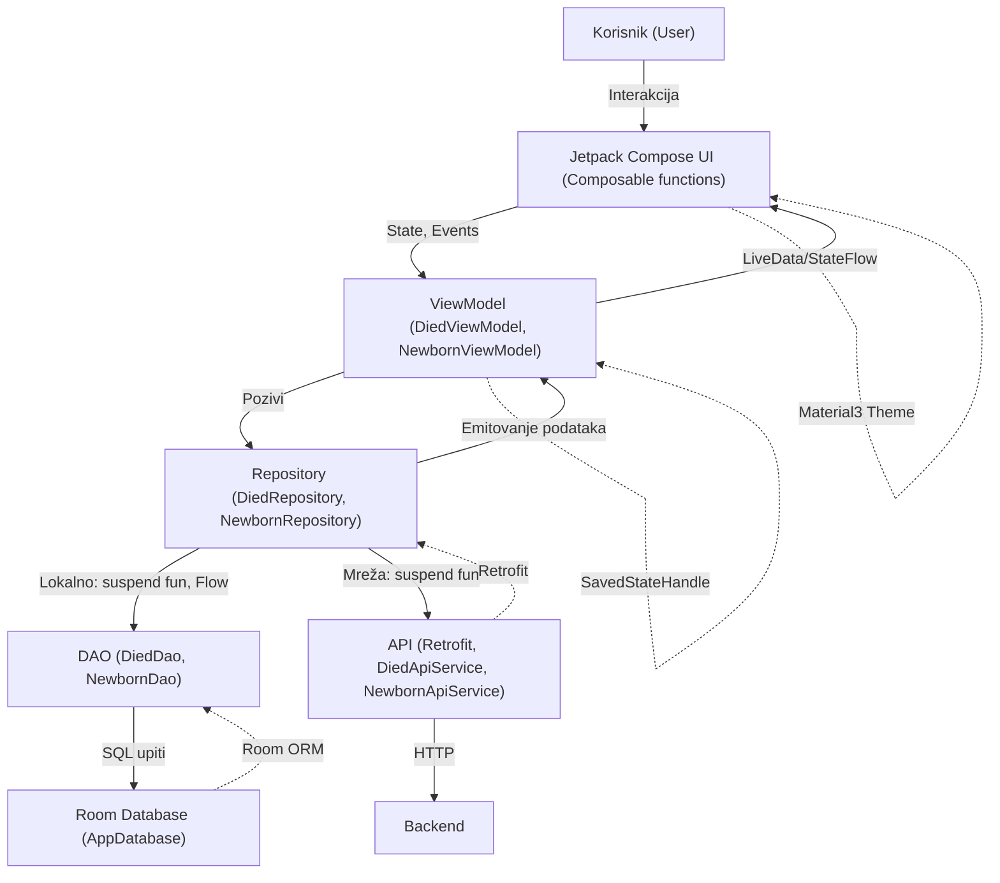

# Dokumentacija Android aplikacije: Statistika novorođenih i umrlih

---

## Sadržaj
- [Opis aplikacije](#opis-aplikacije)
- [Arhitektura aplikacije (MVVM)](#arhitektura-aplikacije-mvvm)
  - [Dijagram komponenti](#dijagram-komponenti)
- [Ključne funkcionalnosti i klase](#ključne-funkcionalnosti-i-klase)
  - [ViewModel-i](#viewmodel-i)
  - [Repozitorijumi](#repozitorijumi)
  - [DAO objekti](#dao-objekti)
  - [Composable funkcije](#composable-funkcije)
- [Korištene Jetpack i Android biblioteke](#korištene-jetpack-i-android-biblioteke)
  - [Room](#room)
  - [ViewModel](#viewmodel)
  - [Jetpack Compose](#jetpack-compose)
  - [State i upravljanje stanjem](#state-i-upravljanje-stanjem)
  - [Coroutines i Flow](#coroutines-i-flow)
  - [Retrofit](#retrofit)
  - [Navigacija u Compose](#navigacija-u-compose)
  - [Material 3 Theming](#material-3-theming)
- [Opšti koncepti Android frameworka](#opšti-koncepti-android-frameworka)
- [Screenshots](#screenshots)

---

## Opis aplikacije

Aplikacija omogućava pregled, filtriranje, sortiranje i analizu podataka o novorođenim i umrlim osobama na području Bosne i Hercegovine. Podaci su dostupni po opštinama, godinama i institucijama, a korisnik može:

- Pretraživati podatke po opštini ili instituciji
- Filtrirati po godini i opštini
- Sortirati po datumu, ukupnom broju i opštini
- Dodavati podatke u favorite
- Prikazivati detalje svakog zapisa sa mini bar chartom
- Dijeliti podatke
- Prikazivati agregirane podatke na grafikonu (bar chart po mjesecima)
- Koristiti aplikaciju na svim veličinama ekrana i u svim orijentacijama (responsive dizajn)

Aplikacija koristi moderni Material 3 dizajn, Jetpack Compose za UI, Room za lokalnu bazu, Retrofit za mrežnu komunikaciju i MVVM arhitekturu za jasno odvajanje slojeva.

---

## Arhitektura aplikacije (MVVM)

Aplikacija je organizovana po MVVM (Model-View-ViewModel) arhitekturi:

- **Model**: Podaci (npr. `Died`, `Newborn`) i Room entiteti, DTO-ovi za mrežu
- **ViewModel**: Posreduje između UI i repozitorijuma, upravlja stanjem, filtrima, sortiranjem i emitovanjem podataka
- **View (UI)**: Jetpack Compose Composable funkcije, reaktivno prikazuju stanje iz ViewModel-a
- **Repository**: Centralizuje pristup podacima (baza, mreža), sadrži poslovnu logiku
- **DAO**: Interfejsi za pristup Room bazi
- **API Service**: Retrofit interfejsi za mrežnu komunikaciju

### Dijagram komponenti

---

## Ključne funkcionalnosti i klase

### ViewModel-i

- **DiedViewModel, NewbornViewModel**
  - Upravljaju stanjem ekrana (StateFlow)
  - Sadrže filtere, sortiranje, favorite, selektovani podatak
  - Pozivaju repozitorijume za podatke
  - Emituju podatke UI-u
  - Potpis: `class DiedViewModel(private val repository: DiedRepository) : ViewModel()`

### Repozitorijumi

- **DiedRepository, NewbornRepository**
  - Centralizuju pristup podacima (baza i mreža)
  - Sadrže suspend funkcije za dohvat, upis, brisanje
  - Potpis: `class DiedRepository(private val diedDao: DiedDao, private val api: DiedApiService)`

### DAO objekti

- **DiedDao, NewbornDao**
  - Interfejsi za Room bazu
  - Sadrže SQL upite kao anotirane metode
  - Potpis: `@Dao interface DiedDao { ... }`

### Composable funkcije

- **DiedListScreen, ListScreen, DetailsScreen, DiedDetailsScreen, ChartScreen**
  - Prikazuju podatke, filtere, detalje, grafikone
  - Reaktivno se ažuriraju na promjenu stanja
  - Potpis: `@Composable fun DiedListScreen(...)`

---

## Korištene Jetpack i Android biblioteke

### Room
- ORM za lokalnu bazu
- Entiteti, DAO, migracije
- Omogućava rad sa bazom kroz Kotlin klase

### ViewModel
- Upravljanje stanjem nezavisno od UI lifecycle-a
- ViewModelScope za coroutines
- SavedStateHandle za čuvanje stanja

### Jetpack Compose
- Deklarativni UI framework
- Composable funkcije, Modifier, Layout
- Navigation Compose za navigaciju

### State i upravljanje stanjem
- `State`, `remember`, `mutableStateOf`, `StateFlow`
- UI se automatski ažurira na promjenu stanja

### Coroutines i Flow
- Asinhroni rad sa podacima
- `viewModelScope.launch`, `suspend fun`, `Flow<T>`
- Reaktivno emitovanje podataka iz baze/mreže

### Retrofit
- HTTP klijent za REST API
- Anotacije za GET/POST
- Moshi za JSON

### Navigacija u Compose
- Navigation Compose API
- NavHost, NavController, composable route
- Navigacija između ekrana i prosljeđivanje parametara

### Material 3 Theming
- Moderni dizajn, boje, tipografija, spacing
- `MaterialTheme`, `ColorScheme`, `Typography`

---

## Opšti koncepti Android frameworka

- **Activity/Fragment lifecycle**: Compose UI je lifecycle-aware, ViewModel-i preživljavaju rotaciju
- **Dependency Injection**: (može se koristiti Hilt ili ručno)
- **Resursi**: Korištenje stringova, boja, tema iz res/values
- **Responsivnost**: Korištenje BoxWithConstraints, Modifier.fillMaxSize(), dinamički layout
- **Testiranje**: Moguće je koristiti JUnit, Espresso, Compose test

---

## Screenshots

> Ovdje ubaciti slike ekrana aplikacije (listanje, detalji, favoriti, grafikon, filteri na tabletu i telefonu, rotacija ekrana...)

- 
- 
- 
- 
- 

---

## Zaključak

Aplikacija je modularna, skalabilna i spremna za proširenje. Korištenjem MVVM arhitekture, Jetpack Compose-a i modernih Android biblioteka, omogućava se lako održavanje, testiranje i proširenje funkcionalnosti. Responsive dizajn i Material 3 osiguravaju odličan korisnički doživljaj na svim uređajima.

---

> **Napomena:** Za detalje o implementaciji pogledati potpise klasa i funkcija u kodu. Za dodatne slike ekrana, koristiti Android Studio emulator ili fizički uređaj. 